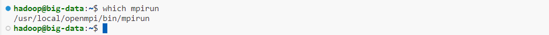
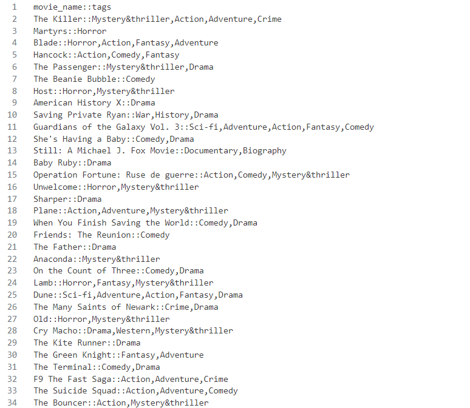
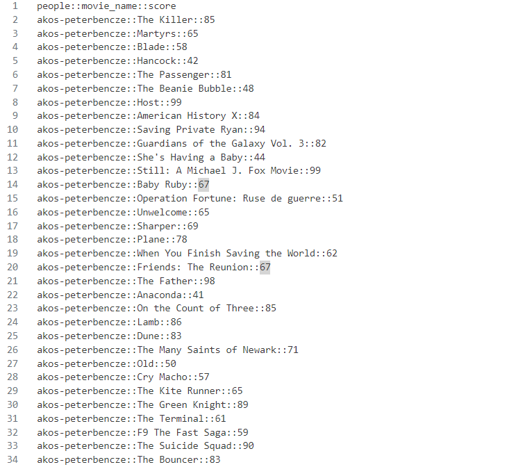
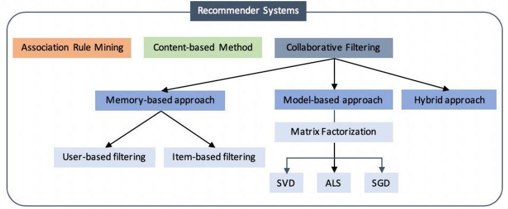

# 个性化电影推荐系统

作者：胡欣凯，陈泽超，刘秋言，荣召康

涉及的知识点：Hadoop/Spark 大数据平台、网络爬虫、Neo4j 图数据库、协同过滤、图神经网络、实时推荐

摘要：为了缓解网络上的信息过载并获得更高的收益，推荐系统已被广泛部署到不同的领域来执行个性化信息过滤，电影推荐是推荐系统的典型应用场景之一。近年来，图神经网络表现出强大的能力，已成为协同过滤的新技术，基于图神经网络的模型（如 LightGCN 等）推广并超越了传统的推荐模型。随着短视频应用的兴起，实时性也成为推荐系统的一个重要目标。我们围绕构建个性化电影推荐系统，进行了基于图数据库的数据可视化展示与分析，实现了 ALS 算法和 LightGCN 图神经网络以构建离线推荐系统，设计并实现了实时化的 Item-CF 算法以构建实时推荐系统，讨论了推荐系统的冷启动策略，以 RMSE、Recall@k、Precision@k 为评价指标对 LightGCN 模型推荐效果进行评价，并展示了推荐系统的推荐效果。

关键词：Spark、Neo4j 图数据库、协同过滤、图神经网络、实时推荐


# 2 背景介绍

在大数据时代，面临海量的信息，将高价值的信息筛选出来并展示给用户成为一个解决信息过载的重要手段。这就是推荐系统主要解决的问题。如今推荐系统已经广泛应用于电子商务、短视频平台、个性化推荐等领域。电影推荐是推荐系统的一个经典应用，尽管如此，我们在其基础上具备图数据库、图神经网络、实时推荐等特色之处。

我们依靠 Spark 大数据平台设计并实现了并行化的推荐系统算法，并能够基于用户与电影的交互数据推荐用户可能感兴趣的电影。本课程报告基于推荐系统（Recommender System，RS）协同过滤（Collaborative Filtering，CF）算法、交替最小二乘（Alternating Least Squares，ALS）算法、深度学习等相关知识，实现了离线推荐的 [ALS 算法](https://spark.apache.org/docs/latest/api/python/reference/api/pyspark.ml.recommendation.ALS.html) 和 [LightGCN](https://arxiv.org/abs/2002.02126) 图卷积神经网络模型，基于 MovieLens 数据集评估了两种推荐算法的特点；基于 Spark Structured Streaming 流式计算框架设计并实现了实时化的 Item-CF 推荐算法。

# 3 内容

该案例的主要内容分为六个部分：Hadoop/Spark 大数据平台搭建、数据集介绍、基于 Neo4j 图数据库的数据存储与可视化、推荐算法介绍、推荐模型训练结果与评价、电影个性化推荐。

## 3.1 Hadoop/Spark 大数据平台搭建

案例基于 Hadoop/Spark 大数据平台搭建，使用 Neo4j 图数据库存储和处理数据，使用 horovod + PySpark + PyTorch 搭建可分布式训练的深度学习模型，并且使用 PyG（pytorch_geometric）库实现 LightGCN 图神经网络。

### 3.1.1 Hadoop/Spark 环境搭建

为满足深度学习模型训练环境，我们在华为云服务器创建 GPU 加速型实例，服务器配置如下图。


安装 Hadoop：
```bash
wget https://mirrors.tuna.tsinghua.edu.cn/apache/hadoop/common/stable/hadoop-3.3.6.tar.gz
tar -zxf hadoop-3.3.6.tar.gz
sudo mv hadoop-3.3.6 /usr/local/hadoop
```

配置环境变量：
```bash
export HADOOP_HOME=/usr/local/hadoop
export PATH=$PATH:$HADOOP_HOME/bin
```

设置权限：
```bash
sudo chown -R hadoop:hadoop /usr/local/hadoop
```

安装 Spark：
```bash
wget https://mirrors.tuna.tsinghua.edu.cn/apache/spark/spark-3.5.0/spark-3.5.0-bin-without-hadoop.tgz
tar -zxf spark-3.5.0-bin-without-hadoop.tgz
sudo mv spark-3.5.0-bin-without-hadoop /usr/local/spark
```

配置环境变量：
```bash
export SPARK_HOME=/usr/local/spark
export PYTHONPATH=$PYTHONPATH:$SPARK_HOME/python:$SPARK_HOME/python/lib/py4j-0.10.7-src.zip
export PYSPARK_PYTHON=python3
export PATH=$PATH:$SPARK_HOME/bin
```

设置权限：
```bash
sudo chown -R hadoop:hadoop /usr/local/spark
```

配置 Spark：
```bash
cd /usr/local/spark
cp conf/spark-env.sh.template conf/spark-env.sh
vim conf/spark-env.sh
```
在该文件中添加：
```bash
export SPARK_DIST_CLASSPATH=$(/usr/local/hadoop/bin/hadoop classpath)
```

运行测试程序：
```bash
/usr/local/spark/bin/run-example SparkPi
```

运行结果为

在搭建的 Hadoop/Spark 平台上运行 word count 算例、绘制词云可视化结果如下。（此处对应课程实验二）


### 3.1.2 Neo4j 图数据库环境搭建

Neo4j 图数据库要求安装 jdk-17 及以上版本：
```bash
wget https://download.oracle.com/java/17/archive/jdk-17.0.9_linux-x64_bin.tar.gz
tar -zxf jdk-17.0.9_linux-x64_bin.tar.gz
sudo mv jdk-17.0.9 /usr/local/java
```

配置环境变量：
```bash
export JAVA_HOME=/usr/local/java
export PATH=$PATH:$JAVA_HOME/bin
```

安装 Neo4j：
```bash
wget https://dist.neo4j.org/neo4j-community-5.12.0-unix.tar.gz
tar -zxf neo4j-community-5.12.0-unix.tar.gz
sudo mv neo4j-community-5.12.0 /usr/local/neo4j
```

配置环境变量：
```bash
export PATH=$PATH:/usr/local/neo4j/bin
```

要允许远程访问数据库，需要编辑配置文件：
```bash
vim /usr/local/neo4j/conf/neo4j.conf
```
在配置文件中查找以下内容，并解除注释：
```
dbms.connectors.default_listen_address=0.0.0.0
```
同时需要开发 7474 和 7687 端口。

### 3.1.3 Horovod + PySpark + PyTorch 环境搭建

#### 更新 `apt`

```bash
sudo apt update
sudo apt upgrade
```

#### 华为云服务器安装 GPU 驱动（CUDA 11.0）

在华为云服务器上部署 CUDA 环境，可参考 [GPU加速型实例自动安装GPU驱动（Linux）](https://support.huaweicloud.com/usermanual-ecs/ecs_03_0199.html) 并根据所选择的云服务器地区、硬件配置和操作系统版本进行安装。我们选择的华为云服务器配置及安装的版本如下。
- 区域：华东-上海一
- CPU架构：x86计算
- 实例类型：GPU加速型pi2
- 镜像：Ubuntu 20.04 server 64bit for GPU(40GiB)
- 自动安装驱动：Driver-450.203.03(Tesla) CUDA-11.0.3 CUDNN-8.1.1

通过 `nvidia-smi` 指令查看驱动是否安装成功：
```
Wed Nov  8 10:43:32 2023       
+-----------------------------------------------------------------------------+
| NVIDIA-SMI 450.203.03   Driver Version: 450.203.03   CUDA Version: 11.0     |
|-------------------------------+----------------------+----------------------+
| GPU  Name        Persistence-M| Bus-Id        Disp.A | Volatile Uncorr. ECC |
| Fan  Temp  Perf  Pwr:Usage/Cap|         Memory-Usage | GPU-Util  Compute M. |
|                               |                      |               MIG M. |
|===============================+======================+======================|
|   0  Tesla T4            On   | 00000000:00:0D.0 Off |                    0 |
| N/A   60C    P8    11W /  70W |      0MiB / 15109MiB |      0%      Default |
|                               |                      |                  N/A |
+-------------------------------+----------------------+----------------------+
                                                                               
+-----------------------------------------------------------------------------+
| Processes:                                                                  |
|  GPU   GI   CI        PID   Type   Process name                  GPU Memory |
|        ID   ID                                                   Usage      |
|=============================================================================|
|  No running processes found                                                 |
+-----------------------------------------------------------------------------+
```

配置环境变量：
```bash
export CUDA_HOME=$PATH:/usr/local/cuda
export CPATH=$CPATH:$CUDA_HOME/include
export LD_LIBRARY_PATH=$LD_LIBRARY_PATH:$CUDA_HOME/lib64
export PATH=$PATH:$CUDA_HOME/bin
```

#### 安装 NCCL 2

NVIDIA Collective Communications Library（NCCL）是 NVIDIA 公司开发的实现多 GPU、多节点集合通信库。NCCL 2 是 horovod 安装的预备环境之一。可参考 [NVIDIA Deep Learning NCCL Documentation](https://docs.nvidia.com/deeplearning/nccl/install-guide/index.html) 进行安装。

```bash
wget https://developer.download.nvidia.com/compute/cuda/repos/ubuntu2004/x86_64/cuda-keyring_1.0-1_all.deb
sudo dpkg -i cuda-keyring_1.0-1_all.deb
sudo apt update
sudo apt install libnccl2=2.18.5-1+cuda11.0 libnccl-dev=2.18.5-1+cuda11.0
```

配置环境变量：
```bash
export LD_LIBRARY_PATH=$LD_LIBRARY_PATH:/usr/include/nccl.h
```

#### 安装 g++ 及 CMake

安装 horovod 之前需安装 g++ 及 CMake。Horovod 要求当使用 PyTorch 框架时应满足 g++-5 及以上版本、当使用 TensorFlow 框架时应满足 g++-8 及以上版本。Horovod 要求 CMake 为 3.13 及以上版本。

```bash
sudo apt-get install gcc-9 g++-9 make cmake
```

#### 安装 OpenMPI 4.0.0

Message Passing Interface（MPI）是由 MPI Forum 组织创建并维护的一套通信标准，具有可移植、高性能 IPC 通信等特点，上层应用程序可以通过调用 MPI 接口来执行消息传递。OpenMPI 是 MPI 接口的一个实现。Horovod 依赖于 OpenMPI 4.0.0 环境运行。

下载 OpenMPI 4.0.0：
```bash
wget https://download.open-mpi.org/release/open-mpi/v4.0/openmpi-4.0.0.tar.gz
tar -zxf openmpi-4.0.0.tar.gz
```

安装：
```bash
cd openmpi-4.0.0
mkdir build
cd build
../configure --prefix=/usr/local/openmpi
sudo make all install
```

配置环境变量：
```bash
export PATH=$PATH:/usr/local/openmpi/bin
export LD_LIBRARY_PATH=$LD_LIBRARY_PATH:/usr/local/openmpi/lib
export CPATH=$CPATH:/usr/local/openmpi/include
```

查看 MPI 环境是否正常：
```bash
which mpirun
```


#### 安装 Python 及各依赖库

为满足 PyG 的运行要求，我们推荐使用 Python 版本在 3.8 至 3.11 之间。

首先更新 pip：
```bash
pip install --upgrade pip
```

安装 PyTorch，注意与 CUDA 版本匹配，CUDA 11.x 环境不可运行 PyTorch 2.0.1 及以上版本；为满足 PyG 运行要求，我们推荐安装的 PyTorch 版本不低于 1.8.1：
```bash
pip install torch==1.9.1+cu111 torchvision==0.8.1+cu110 torchaudio==0.7.0 -f https://download.pytorch.org/whl/torch_stable.html
```


安装 TensorBoard：
```bash
pip install tensorboard -i https://pypi.tuna.tsinghua.edu.cn/simple
```

安装 Horovod：
```bash
HOROVOD_WITH_PYTORCH=1 HOROVOD_GPU_OPERATIONS=NCCL pip install --no-cache-dir horovod[spark,pytorch] -i https://pypi.tuna.tsinghua.edu.cn/simple
```

安装完成后，检查 horovod 配置是否正常：
```bash
horovodrun --check-build
```

```
Horovod v0.28.1:

Available Frameworks:
    [ ] TensorFlow
    [X] PyTorch
    [ ] MXNet

Available Controllers:
    [X] MPI
    [X] Gloo

Available Tensor Operations:
    [X] NCCL
    [ ] DDL
    [ ] CCL
    [X] MPI
    [X] Gloo
```

作为测试，我们在搭建好的 horovod 环境下运行中文手写数字识别任务（此处对应实验三拓展），结果如下图。


### 3.1.4 PyG 环境搭建

可直接通过 pip 命令安装 PyG 及其依赖库。

```bash
pip install torch_geometric -i https://pypi.tuna.tsinghua.edu.cn/simple
```

```bash
pip install --no-index torch-scatter -f https://pytorch-geometric.com/whl/torch-1.9.1+cu110.html
```

### 3.1.5 Spark Structured Streaming

Spark Structured Streaming 是 Spark 提供的流式计算框架，为 Spark Streaming 的改进版本。Spark Structured Streaming 不需要额外配置环境，这里仅演示 word count 算例的实时运行结果。

在 shell 中输入命令 `nc -lk 23333`，它将逐行接收 shell 中的文本内容，并以 socket 形式转发至 23333 端口。随后运行测试程序。


程序将持续接收来自 23333 端口的数据并实时处理。逐行输入以下文本：


word count 程序运行结果如下：


至此，配置完成了程序运行所需的所有环境。

## 3.2 数据集介绍

### 3.2.1 MovieLens 数据集介绍

MovieLens 数据集是用于推荐算法的常用数据集，由 the University of Minnesota 的 GroupLens Research Project 收集，包含用户、电影及用户对电影的评分数据。MovieLens 数据集根据数据规模分为 MovieLens 1B、MovieLens 100K、MovieLens 1M、MovieLens 10M、MovieLens 20M、 MovieLens 25M 等多个版本。我们在 MovieLens 100k、MovieLens 1M 和 MovieLens 10M 数据集上对推荐模型进行测试和评价。这些数据集结构总体相似，此处仅以 MovieLens 100k 数据集为例进行介绍。

- 数据来源：[MovieLens](https://grouplens.org/datasets/movielens/)

#### `u.data` 数据表

包含 943 名用户对 1682 部电影的评分数据。每名用户至少评价过 20 部电影。

属性:
- `user_id` 标识不同的用户。$\text{user\_id} \in \left\{1,2,\dots,943\right\}$。
- `movie_id` 标识不同的电影。$\text{item\_id} \in \left\{1,2,\dots,1682\right\}$。
- `rating` 为用户对电影的评分。$\text{rating} \in \left\{ 0, 1, 2, 3, 4, 5 \right\}$。
- `timestamp` 为时间戳，记录从 1/1/1970 UTC 至用户评价时刻的秒数。

示例：

| user_id | movie_id | rating | timestamp |
| --- | --- | --- | --- |
| 196 | 242 | 3 | 881250949 |

#### `u.item` 数据表

包含 1682 部电影的信息。

属性：
- `movie_id` 标识不同的电影。$\text{item\_id} \in \left\{1,2,\dots,1682\right\}$。
- `movie_title` 为电影标题（含播出年份）。
- `release_date` 为电影播出日期
- `imdb_url` 为电影在 imdb 网站的链接。
- 数据表还包含电影的标签，标签以 multi-hot 形式被分为 19 列。

示例：
| movie_id | movie_title | release_date | video_release_date | imdb_url | tags... |
| --- | --- | --- | --- | --- | --- |
|1|Toy Story (1995)|01-Jan-1995||http://us.imdb.com/M/title-exact?Toy%20Story%20(1995)|0, 0, 0, 1, 1, 1, 0, 0, 0, 0, 0, 0, 0, 0, 0, 0, 0, 0, 0|

#### `u.user` 数据表

包含 943 名用户的信息。

属性：
- `user_id` 标识不同的用户。$\text{user\_id} \in \left\{1,2,\dots,943\right\}$。
- `age` 为用户的年龄。$\text{age} \ge 0$。
- `gender` 为用户的性别。$ \text{gender} \in \left\{`F`, `M`\right\} $
- `occupation` 为用户的职业。
- `zip_code` 为邮政编码。

示例：
| user_id | age | gender | occupation | zip_code |
| --- | --- | --- | --- | --- |
| 1 | 24 | M | technician | 85711 |

#### `u.info` 数据表

包含用户、电影、评分的数量。

#### `u.genre` 数据表

列举了数据集中出现的电影的类型。

#### `u.occupation` 数据表

列举了数据集中出现的用户的职业。

#### 数据统计信息

| # of users | # of movies | # of ratings | density |
| --- | --- | --- | --- |
| 943 | 1682 | 100000 | 6.3% |

### 3.2.2 电影网站 RottenTomatoes 爬虫思路

网络爬虫通过 `BeautifulSoup4` 库和 Python 内置的 `json` 库和 `requests` 库实现。


在电影网站 RottenTomatoes 中，通过抓包发现其提供用户评分接口 `https://www.rottentomatoes.com/napi/critics/{userName}/movies?pagecount=100` 其中 `{userName}` 为网站中存储的评论用户姓名。


因此下一步设法获取用户列表。在地址 `https://editorial.rottentomatoes.com/otg-article/new-critics/{index}` 中，`index` 为 1 至 14 的页面编号，每页为包含用户列表。


对用户列表网页进行分析，利用 CSS 选择器找到每个用户实际保存在网站中的姓名（用户书面姓名与其在网站中存储的姓名文本不一定相同）。CSS 选择器路径为：
```
.articleContentBody > p:nth-child(3) > a:nth-child({})
```

接下来，将获取到的用户姓名填入用户评分 API 网址中，即可得到用户列表中所有用户的电影评分数据。

对于电影标签数据，只需要抓取电影详细信息页上的 `class` 属性为 `genre` 的指定元素即可。由于原始数据可能包含大量的空格符和换行符，因此需要对数据进行清理。我们利用 `BeautifulSoup` 提供的 `find()` 函数，以快速找到所需要的信息。

爬取的部分电影标签数据：


爬取的部分电影评分数据：


为统一数据存储格式，我们为每一名用户和电影进行编号，并使用与 MovieLens 数据集相同的 `::` 作为数据分隔符。

## 3.3 基于 Neo4j 图数据库的数据存储与可视化

图与推荐系统之间存在天然的联系。推荐系统中的大部分信息，如用户-物品交互、用户之间的社交关系、物品之间的关联关系、知识图谱等，都可以自然地通过图来描述。这是我们选择图数据库的原因。

Neo4j 图数据库是高性能的 NoSQL 图数据库，它提供了大规模可扩展性，支持超大规模图数据的处理，并且能够集群部署到多台机器中。Neo4j 是目前使用最广、用户最多的图数据库之一。此外，Neo4j 图数据库提供了良好的可视化界面，能够直观地呈现数据节点之间的关系。

我们将数据集存储在 Neo4j 图数据库中。数据库将每名用户作为一个 User 节点、将每部电影作为一个 Movie 节点，用户对电影的评分、系统为用户作出推荐的结果作为连接 User 节点和 Movie 节点的边；在实时推荐模块，我们将用户的兴趣向量作为 User 节点的属性进行存储。

### 3.3.1 Neo4j 图数据库的基本使用

启动 Neo4j

```shell
$ <neo4j-home>/bin/neo4j start
```

停止 Neo4j

```shell
$ <neo4j-home>/bin/neo4j stop
```

启动 Neo4j 后可在默认端口 `http://localhost:7474` 通过 `Cypher` 语句操作数据库。要使外部能够登录并访问数据库，需开发 7474 和 7687 端口。


### 3.3.2 通过 Cypher 语句将数据集加载到数据库

#### 数据预处理

1. 通过指令下载 MovieLens 10M 数据集。
```sh
wget https://files.grouplens.org/datasets/movielens/ml-10m.zip
```

2. 解压数据集，放置在目录 `/usr/local/neo4j/imports` 下，其中 `/usr/local/neo4j` 为 Neo4j 数据库的安装路径。

3. 使用 `vim` 命令 `:%s#::#\t#g` 将 `movies.dat` 文件、`ratings.dat` 文件、`tags.dat` 文件中的分隔符 `::` 替换为 `\t`。这是在因为通过 `CSV` 加载数据文件时，分隔符字符串的长度被限定为 1。

4. 使用 `vim` 命令 `:%s#"#\\"#g` 将 `movies.dat` 文件、`tags.dat` 文件中的双引号 `"` 替换为转义后的 `\"`。

在实时推荐部分的数据处理还包括将电影的标签列表转换为标签向量。该处理在代码运行时进行，以维持图数据库展示信息的直观性。

#### 加载 Movies 数据表并创建索引

```Cypher
LOAD CSV 
FROM 'file:///movies.dat' AS row 
FIELDTERMINATOR '\t' 
CREATE (
    :Movie { 
        MovieID:toInteger(row[0]), 
        Title:row[1], 
        Genres:row[2] 
    }
);
```

```Cypher
CREATE INDEX MovieIndex FOR (m:Movie) ON (m.MovieID);
```

#### 加载 Users 数据表并创建索引

在 MovieLens 10M 中并未提供 User 数据表，因此这里从 Ratings 数据表中提取出现过的 UserID 生成 User 数据表以建立 User 节点。

```Cypher
LOAD CSV 
FROM 'file:///users.dat' AS row 
FIELDTERMINATOR '\t' 
CREATE (
    :User { 
        UserID:toInteger(row[0]) 
    }
);
```

```Cypher
CREATE INDEX UserIndex FOR (u:User) ON (u.UserID);
```

#### 加载 Ratings 数据表

在 Ratings 数据表中包含 10000000 条评分数据，将这些数据一次性加载进数据库将超出单个事务可分配的最大内存。因此这里通过 `CALL {} IN TRANSACTIONS OF` 子句分批插入数据（该过程耗时较长）。

```Cypher
:auto 
LOAD CSV 
FROM 'file:///ratings.dat' AS row 
FIELDTERMINATOR '\t' 
CALL { 
    WITH row 
    MATCH (u:User{UserID:toInteger(row[0])}) WITH row, u 
    MATCH (m:Movie{MovieID:toInteger(row[1])}) WITH row, u, m 
    CREATE (u)-[:Rate{ Rating:toInteger(row[2]), Timestamp:toInteger(row[3]) }]->(m) 
} 
IN TRANSACTIONS OF 500 rows;
```

```Cypher
CREATE INDEX RateIndex FOR ()-[r:Rate]->() ON (r.Timestamp);
```


#### 加载 Tags 数据表

```Cypher
:auto LOAD CSV 
FROM 'file:///tags.dat' AS row 
FIELDTERMINATOR '\t' 
CALL { 
    WITH row 
    MATCH (u:User{UserID:toInteger(row[0])}) WITH row, u 
    MATCH (m:Movie{MovieID:toInteger(row[1])}) WITH row, u, m 
    CREATE (u)-[:Comment{ Tag:row[2], Timestamp:toInteger(row[3]) }]->(m) 
} 
IN TRANSACTIONS OF 500 rows;
```

```Cypher
CREATE INDEX CommentIndex FOR ()-[c:Comment]->() ON (c.Timestamp);
```

### 3.3.3 数据可视化展示

#### 300 条评分数据展示

```Cypher
MATCH p=()-[Rate]->() RETURN p LIMIT 300;
```


#### UserID 为 1 的用户评价过的电影

```Cypher
MATCH (u:User{UserID:1})-[r:Rate]->(m:Movie) RETURN u, r, m;
```


#### 评价过 MovieID 为 1 的电影的用户

```Cypher
MATCH (u:User)-[r:Rate]->(m:Movie{MovieID:1}) RETURN u, r, m;
```


#### 查看 Movie 节点属性

```Cypher
MATCH (m:Movie{MovieID:1}) return m;
```


#### 查询 UserID 为 6 的用户对电影 'Shakespeare in Love (1998)' 的评分

```
MATCH (:User{UserID:6})-[r:Rate]->(:Movie{Title:'Shakespeare in Love (1998)'}) RETURN r;

╒═════════════════════════════════════════╕
│r                                        │
╞═════════════════════════════════════════╡
│[:Rate {Rating: 5,Timestamp: 1001082973}]│
└─────────────────────────────────────────┘
```

#### MovieLens 10M 数据集统计信息

用户总数
```
MATCH (u:User) RETURN COUNT(u);

╒════════╕
│COUNT(u)│
╞════════╡
│69878   │
└────────┘
```

电影总数
```
MATCH (m:Movie) RETURN COUNT(m);

╒════════╕
│COUNT(m)│
╞════════╡
│10681   │
└────────┘
```

评分总数
```
MATCH (User)-[r:Rate]->(Movie) RETURN COUNT(r);

╒════════╕
│COUNT(r)│
╞════════╡
│10000054│
└────────┘
```

评分均值
```
MATCH (User)-[r:Rate]->(Movie) RETURN AVG(r.Rating);

╒══════════════════╕
│AVG(r.Rating)     │
╞══════════════════╡
│3.4100109859406156│
└──────────────────┘
```

### 3.3.4 通过Spark连接Neo4j图数据库

安装 Spark 后，根据 Spark 版本和 Scala 版本选择合适的 JAR 包并安装。下载地址：[https://neo4j.com/product/connectors/apache-spark-connector/](https://neo4j.com/product/connectors/apache-spark-connector/)


通过以下代码可以通过 PySpark 连接 Neo4j 图数据库并从数据库中读取数据。

```Python
def read_query(query) -> DataFrame:
    spark: SparkSession = (
        SparkSession.builder
        .master("local")
        .appName("Connect Neo4j")
        .config("spark.jars", "jars/neo4j-connector-apache-spark-5.2.0/neo4j-connector-apache-spark_2.12-5.2.0_for_spark_3.jar")
        .getOrCreate())
    
    db_reader: DataFrameReader = (
        spark.read
        .format("org.neo4j.spark.DataSource")
        .option("url", "neo4j://localhost:7687")
        .option("authentication.type", "basic")
        .option("authentication.basic.username", "neo4j")
        .option("authentication.basic.password", "20214919")
        .option("access.mode", "read")
    )

    return (
        db_reader.option(
            "query", query
        ).load())
```

在以上代码中 `spark` 导入已安装的 JAR 包，在 `db_reader` 中设置图数据库的端口号、数据库名称、数据库密码。可以通过执行 Cypher 语句或其他方式读取数据。

## 3.4 推荐算法介绍

### 3.4.1 推荐算法总体介绍



总体来看，推荐算法可分为基于统计数据的推荐算法、基于用户的推荐算法、基于物品的推荐算法和协同过滤算法，其中协同过滤算法可细分为基于基于用户的协同过滤、基于物品的协同过滤、基于模型的协同过滤和混合类型的协同过滤，基于模型的协同过滤算法又可由多种机器学习、深度学习算法实现。

随着深度学习的快速发展，基于模型的协同过滤算法，尤其是深度学习算法已经成为推荐算法的主流算法。并且由于用户与物品之间的交互、用户社交关系网络等数据很适合用图模型进行表示，因此基于图神经网络的推荐算法也已经逐渐发展起来，成为研究的热点。至今已经发展起来基于用户-物品交互图、社交网络图、知识图谱、混合图等多种图结构的推荐系统。

根据收集到的用户与物品交互信息的类型不同，还可将协同过滤算法分为显式反馈模型（用户对物品的明确评价，如评分等）和隐式反馈模型（用户对物品的不明确评价，如浏览、点击等）。在实际应用场景中，隐式反馈数据往往容易获得，而显示反馈数据则少得多。

从推荐实时性角度看，推荐算法可分为离线推荐算法和实时推荐算法。深度学习模型由于难以利用流式数据进行训练，且训练往往花费大量时间，因此难以满足实时推荐需求；另一方面，基于用户、基于物品以及基于机器学习模型的推荐算法由于实现简单、计算高效且能够保证基本的推荐效果，因此在实时推荐中广泛使用，发挥着重要作用。

我们选择了 ALS 算法和 LightGCN 图神经网络模型构建离线推荐系统。两种推荐模型均基于用户与物品的显示反馈数据，即对用户-物品评分矩阵进行预测。我们在 MovieLens 100k 等数据集上以 RMSE 作为评价指标对 ALS 和 LightGCN 模型进行了横向对比。

我们还以推荐系统中更常用的 Precision@k 和 Recall@k 为评价指标，将用户与电影的评分视作隐式反馈数据，以贝叶斯个性化排序损失（BPR 损失）作为损失函数训练 LightGCN 模型。

此外，为满足实时推荐需求，我们设计了一个简单的基于物品的实时推荐算法。我们通过 `nc -lk` 命令模拟用户对电影的实时评分数据流，通过 Structured Streaming 对流式数据进行处理，并实时更新、展示推荐结果。

冷启动问题是推荐系统需要考虑的另一难题。无论是 ALS 算法还是 LightGCN 模型，其输出的结果都依赖于对用户、电影的特征的计算。而当出现一个新用户时，这些特征没有用以计算的依据，因此无法对用户的喜好进行准确的预测。这时可根据每部电影获得评分的均值代表电影的热度或质量，并据此向用户作出推荐；同样，当出现一部新电影时，可以根据特征工程或人工标注等方法将电影进行归类，并根据类型相似的电影进行推荐。当新用户评价过若干部电影时，或者新电影收到若干评分时，则可将评分数据加入训练数据集并更新模型参数。

### 3.4.2 协同过滤算法的数据表示

在协同过滤算法中，用户和物品可表示为包含 $d$ 个特征的向量。记第 $i$ 个用户为 $u_i \in \mathbb{R}^d$，第 $j$ 个物品（本例中为电影）为 $v_j \in \mathbb{R}^d$；用户数为 $m$，不同种物品数为 $n$；$m$ 个用户的特征组成用户矩阵 $U \in \mathbb{R}^{m \times d}$，$n$ 部电影的特征组成物品矩阵 $V \in \mathbb{R}^{n \times d}$；用户对物品的评分记为评分矩阵 $R \in \mathbb{R}^{m \times n}$，其中 $R_{ij}$ 为用户 $i$ 对电影 $j$ 的评分。

推荐模型可抽象地表示为 $f: \mathbb{R}^d \times \mathbb{R}^d \to \mathbb{R}$，并且可以用 $f\left(u_i, v_j\right)$ 近似为用户 $i$ 对电影 $j$ 的评分 $R_{ij}$ 。这样，就可以用收集到的评分数据对模型 $f$ 进行拟合。

### 3.4.3 基于矩阵分解的 ALS 推荐算法

交替最小二乘法 (Alternating Least Squares, ALS) 是针对该模型求解而设计的优化算法。它的基本思想是固定一个参数并解另一个参数，然后交替执行。在矩阵分解的背景下，我们持有用户矩阵$U$不变并解物品矩阵 $V$ ，然后持有物品矩阵 $V$ 不变并解用户矩阵$U$，如此交替进行。

#### 数学背景

ALS 算法将推荐模型抽象为 $f\left(u, v\right) = u \cdot v^T$ ，假设我们有一个用户-物品评分矩阵 $R$ 大小为 $m \times n$，其中 $m$ 是用户数，$n$ 是物品数。我们的目标是找到两个矩阵 $U$ (用户矩阵，大小为 $m \times d$) 和 $V$ (物品矩阵，大小为 $n \times d$) ，其中 $d$ 是预定义的潜在特征数，使得 $R$ 近似于 $U$ 和 $V$ 的乘积，即 $R \approx U V^T$ 。

为了得到上述公式中的 $U$ 和 $V$ ，我们可以使用最小化均方根误差
$$
 L = \arg\min\limits_{(u, v) \in  \Omega}\sqrt{\sum\limits_{\left(i, j\right) \in \mathcal{R}} \left( f\left(u_i, v_j\right) - R_{ij} \right)^2} 
$$
来衡量参数的拟合的程度，其中 $L$ 为损失函数， $\Omega$ 是已知的评分集合，$u_i$ 是用户 $i$ 的潜在特征向量，$v_j$ 是物品 $j$ 的潜在特征向量。

为了防止过拟合，我们可以加入正则化项：

$$
L = \arg\min\limits_{(u, v) \in  \Omega}\sqrt{\sum\limits_{\left(i, j\right) \in \mathcal{R}} \left( f\left(u_i, v_j\right) - R_{ij} \right)^2 + \lambda (\|u_i\|^2 + \|v_j\|^2)}
$$
其中 $\lambda$ 是正则化系数，它有助于确保 $U$ 和 $V$ 的值不会过大，从而防止模型过度拟合训练数据。

#### 交替最小化策略

持有 $V$ 固定并解 $U$（或反之）是一个线性回归问题，因此我们可以使用已知的封闭形式解决方案。

例如，为了计算用户 $i$ 的向量 $u_i$，我们可以使用以下公式：

$$
u_i = (v^T v + \lambda I)^{-1} v^T r_i
$$
其中 $r_i$ 是用户 $i$ 的评分向量，$I$ 是单位矩阵，$\lambda$ 是正则化系数。

接下来我们可以通过迭代优化的方法进行 $U$ 和 $V$ 的求解

1. 随机初始化 U 和  V 。
2. 固定 U 并更新  V 。
3. 固定  V  并更新 U。
4. 重复步骤2和3直到满足收敛标准。

通过这种方法，ALS 算法能够找到描述用户和物品之间关系的潜在特征向量，并可以用来预测缺失的评分。

#### 迭代流程

考虑一个简化的场景：我们有一个用户-电影评分矩阵 $R$ ，其中 $ R_{i,j} $ 表示用户i对电影j的评分。但这个矩阵是巨大且稀疏的，因为并非每个用户都评价了每部电影。

矩阵分解的核心思想是，尝试将这个大矩阵近似分解为两个较小的矩阵：用户矩阵 $ U $ 和电影矩阵 $ V $ 的乘积。

其中， $ U $ 的每行代表一个用户的潜在特征向量，而 $ V $ 的每行代表一个电影的潜在特征向量。这些潜在特征捕获了影响用户偏好和电影特性的各种因素。

例如，一个潜在特征可能代表“对动作片的喜好”。如果用户 $i$ 非常喜欢动作片，那么 $ u_{i} $ 的该特征值会很高；如果电影 $j$ 是动作片，那么 $ v_{j} $ 的该特征值也会很高。

通过ALS算法进行迭代优化，我们试图找到 $ U $ 和 $ V $ 使得它们的乘积与原始评分矩阵 $ R $ 尽可能接近。这可以通过最小化损失函数 $L$ 来实现。

一旦得到了最优的 $ U $ 和 $ V $ 矩阵，预测用户 $i$ 对于电影j的评分就变得简单了，只需计算：
$$
\hat{R}_{ij} = u_i \times v_j^T
$$
这样，为用户提供推荐就是预测他们尚未评分的电影的评分，然后选择预测评分最高的电影推荐给用户。


### 3.4.4 基于图神经网络模型 LightGCN 的推荐算法

#### 算法原理

图神经网络 (Graph Neural Networks, GNNs) 是专为处理图数据设计的深度学习方法。在这些网络中，信息通过图的结构传播，使得每个节点（例如，用户或物品）能够聚合其邻居的信息。GCNs 是一种流行的用卷积方式聚合邻居节点信息的图神经网络，是为了学习图数据内的模式而设计的网络。GCNs 的核心原理是利用图结构来捕获用户和物品之间的交互关系，直接在嵌入中编码交互信号，进而实现对关系的编码。交互物品可以被视为用户的特征，因为它们提供了用户偏好的直接证据。类似地，消费物品的用户可以被视为物品的特征，并用于测量两个物品的协同相似性。

#### 数学背景

为了理解 LightGCN，我们首先需要了解图卷积 (GCNs) 的基本概念。在一个图中，一个节点可以通过以下方式更新其特征：

$$
h_v' = \text{aggregate}(\{ h_u : u \in \text{Neighbours}(v) \})
$$
其中 $ h_v' $ 是节点 $v$ 的新特征，$\text{Neighbours}(v)$ 是 $v$ 的邻居，而 $\text{aggregate}$ 是一个函数，用于聚合邻居的信息。

GCNs 中的图卷积操作表示为：

$$
\begin{array}{l}
\mathbf{e}_{u}^{(k+1)}=\sigma\bigl( \mathbf{W}_{1}\mathbf{e}_{u}^{(k)} + \sum_{i \in \mathcal{N}_{u}} \frac{1}{\sqrt{\left|\mathcal{N}_{u}\right|} \sqrt{\left|\mathcal{N}_{i}\right|}} (\mathbf{W}_{1}\mathbf{e}_{i}^{(k)} + \mathbf{W}_{2}(\mathbf{e}_{i}^{(k)}\cdot\mathbf{e}_{u}^{(k)}) ) \bigr)
\\
\mathbf{e}_{i}^{(k+1)}=\sigma\bigl( \mathbf{W}_{1}\mathbf{e}_{i}^{(k)} +\sum_{u \in \mathcal{N}_{i}} \frac{1}{\sqrt{\left|\mathcal{N}_{i}\right|} \sqrt{\left|\mathcal{N}_{u}\right|}} (\mathbf{W}_{1}\mathbf{e}_{u}^{(k)} + \mathbf{W}_{2}(\mathbf{e}_{u}^{(k)}\cdot\mathbf{e}_{i}^{(k)}) ) \bigr)
\end{array}
$$
其中 $ \mathbf{W}_{1} $ 和 $ \mathbf{W}_{2} $ 是可训练的权重矩阵，$$ \frac{1}{\sqrt{\left|\mathcal{N}_{i}\right|} \sqrt{\left|\mathcal{N}_{u}\right|}} $$是表示为图拉普拉斯范数的贴现因子，$\mathcal{N}_{u} $ 和 $\mathcal{N}_{i} $ 表示用户 $u$ 和项目 $i$ 的第一次迭代时的邻居，并且 $\sigma$ 是非线性的。

#### GCNs 的简化


大多数 GCNs 在此基础上增加了额外的复杂性，例如权重、非线性激活函数和其他特性。然而，LightGCN 顾名思义，是基于一个关键观察而设计的，即在推荐系统的上下文中，简单的线性聚合通常可以获得更好的性能。因此，LightGCN 去除了许多传统 GCNs 中的额外复杂性，仅保留了图卷积的基本操作，即只执行邻居嵌入的规范化总和。

在 LightGCN 中，图卷积操作被简化为：

$$
\begin{aligned}
\mathbf{e}_{u}^{(k+1)}=\sum_{i \in \mathcal{N}_{u}} \frac{1}{\sqrt{\left|\mathcal{N}_{u}\right|} \sqrt{\left|\mathcal{N}_{i}\right|}} \mathbf{e}_{i}^{(k)} \\
\mathbf{e}_{i}^{(k+1)}=\sum_{u \in \mathcal{N}_{i}} \frac{1}{\sqrt{\left|\mathcal{N}_{i}\right|} \sqrt{\left|\mathcal{N}_{u}\right|}} \mathbf{e}_{u}^{(k)}
\end{aligned}
$$
这里的标准化项 $\frac{1}{\sqrt{\left|\mathcal{N}_{u}\right|} \sqrt{\left|\mathcal{N}_{i}\right|}} $ 遵循标准 GCN 的设计。

结合每层的嵌入形成最终用户和物品的表达:

$$
\mathbf{e}_{u}=\sum_{k=0}^{K} \alpha_{k} \mathbf{e}_{u}^{(k)} ; \quad \mathbf{e}_{i}=\sum_{k=0}^{K} \alpha_{k} \mathbf{e}_{i}^{(k)}
$$
模型预测可以通过最终用户表达和物品表达的内积得到：

$$
\hat{y}_{u i}=\mathbf{e}_{u}^{T} \mathbf{e}_{i}
$$
这样，通过述迭代过程，我们不仅得到每个节点的嵌入，而且这些嵌入将包含图中的丰富结构信息，这对推荐系统来说是非常宝贵的。

#### 迭代流程

考虑一个简化的电影推荐系统，其中包含三名用户：用户 1、用户 2、和用户 3。系统内有三部电影：电影 1、电影 2 和电影 3。以下是用户与电影的互动情况：

- 用户 1 观看了电影 1 和电影 2。
- 用户 2 观看了电影 2。
- 用户 3 观看了电影 1 和电影 3。

1. 初始化

首先，为每位用户和每部电影分配一个初始的嵌入表示。这些嵌入通常被初始化为随机向量。

2. 构建正则化的邻接矩阵

根据用户与电影的互动，构建邻接矩阵。例如，如果用户 1 观看了电影 1，那么用户 1 和电影 1 之间在邻接矩阵中的值为 1，否则为 0。使用该邻接矩阵，进一步进行正则化处理。

3. 层次迭代

在第一次迭代中：

- 电影1的新嵌入是它的初始嵌入与用户 1 和用户 3 的嵌入的总和，因为他们都观看了这部电影。
- 电影 2 的新嵌入是它的初始嵌入与用户 1 和用户 2 的嵌入的总和。
- 电影 3 的新嵌入是它的初始嵌入与用户 3 的嵌入。

4. 进行多次迭代

在接下来的迭代中，每部电影的嵌入都会基于与之互动的用户的嵌入，以及这些用户与其他电影的互动进行更新。例如，如果用户 1 观看了电影 1 和电影 2，那么在后续迭代中，这两部电影的嵌入将会越来越相似。

5. 结果

经过多次迭代后，每部电影的嵌入将捕捉到更深层次的用户交互信息。这不仅基于用户与电影的直接交互，还包括了用户与他们观看的其他电影，以及其他用户与这些电影的交互。

最终，使用这些电影的嵌入向用户提供电影推荐。例如，如果用户 2 的嵌入与电影 1 的嵌入非常相似，那么系统可能会推荐电影 1 给用户 2，尽管用户 2 过去没有观看过这部电影。

### 3.4.5 基于物品的协同过滤实时推荐算法

实时推荐算法需满足计算高效的要求。而无论是 ALS 算法还是 LightGCN 模型，当面临新数据时，都需要重新训练模型参数，因此难以满足实时推荐要求。我们设计了一个简单的基于物品的协同过滤算法。

算法的核心思路是为每一名用户定义兴趣向量 $U$，对于收集到的电影的标签向量（可以提供对电影的实际标签进行编码得到，也可以是从离线推荐模型中训练得到的抽象标签）$T$，$U$ 与 $T$ 向量维度相同，分别表示用户感兴趣的特征和电影的特征。若 $U_i$ 和 $T_j$ 的相似度越高，则表示用户 $i$ 对电影 $j$ 越感兴趣。相似度可通过余弦相似度等来衡量：$$ S = \frac{ U_i \cdot T_j }{ \Vert U_i \Vert _2^2 \cdot \Vert T_j \Vert _2^2 } $$

当数据 $<i, j, r_{ij}>$ 实时流入时，将对用户 $i$ 的兴趣向量进行更新：$$ U_i := r_{ij} \lambda U_i + \left(1 - r_{ij} \lambda \right) T_j $$
式中 $\lambda$ 为调节用户短期兴趣考虑程度的参数，当 $\lambda$ 较大时更多考虑用户的长期兴趣，当 $\lambda$ 较小时更多考虑用户的短期兴趣。此更新公式的本质，是将 $U_i$ 视为所有电影标签向量的加权求和。直观上看，权重大的电影标签向量将与用户兴趣向量更相似。在公式更新时，最近观看的、评分最高的电影将具有更高的权重，因此该算法将倾向于为用户推荐此类电影。该算法计算简单高效，原理直观，且综合考虑用户的长期兴趣和短期兴趣和电影评分，因此我们认为该算法适合作为系统的实时推荐算法。

## 3.5 推荐模型训练结果与评价

### 3.5.1 推荐模型的评价指标

衡量推荐系统性能的评价指标有多种，根据数据集的特点可以选择不同的评价指标。部分评价指标的计算方法和适用情形如下表所示。

| 评价指标 | 计算方法 | 应用场景 |
| --- | --- | --- |
| RMSE | $\text{RMSE} = \sqrt{\frac{1}{m}\sum\limits_{i=1}^{m}{\left(R_{ij} - f\left( u_i, v_j \right)\right)^2}}$ | 显示反馈数据（如评分等）|
| MSE | $MSE = RMSE ^ 2$ | 与 RMSE 类似 |
| Precision@k | $\text{Precision@k} = \frac{\text{推荐结果中相关的\ item\ 数量}}{推荐结果中的\ item\ 总数量}$ | 隐式反馈数据（如点击、观看等）|
| Recall@k | $\text{Recall@k} = \frac{\text{推荐结果中相关的\ item\ 数量}}{所有相关的\ item\ 数量}$ | 与 Recall@k 类似 |

在实际应用中，由于收集到的数据大部分为隐式反馈数据，因此使用 Recall@k 等评价指标更为常见。

由于 MovieLens 数据集提供用户与电影的显式反馈（评分）数据，可以将预测评分矩阵视作一个回归问题。因此我们可以选择计算相对简单的均方根误差（RMSE）作为评价指标。

此外，若将用户与物品之间的交互视为隐式反馈数据（即不考虑用户评分数值），则可采用 Precision@k 和 Recall@k 作为评价指标。


### 3.5.2 LightGCN 训练结果

我们在 MovieLens 100K 和 MovieLens 10M 数据集上训练 LightGCN 模型。

以 RMSE 为评价指标时，我们以 RMSE 作为模型损失函数，采用 5 折交叉验证法，即将完整的数据集划分为 5 个不相交的子集，每个子集分别作为测试集、其他 4 个子集作为训练集进行共 5 次训练，并以 5 次训练的损失的平均值来衡量模型的性能。

我们发现，在 5 折交叉验证中，无论 5 份数据集划分中的哪一份作为测试集，得到的 RMSE 数值和 RMSE 变化曲线均相差不大。这里仅展示 5 次训练中的某一次得到的 RMSE 变化曲线。

在 MovieLens 10M 数据集上训练结果：


在 MovieLens 100k 数据集上训练结果：


多次训练得到的平均 RMSE 值整理为下表。需说明的是，受限于云服务器费用和耗时限制，下列结果为单机版模型运行结果（在 MovieLens 10M 数据集上进行训练耗时约为每次训练 1 至 2 小时，因此我们提供能够在云服务器上进行分布式训练的代码，但是不在该数据集上完成模型的分布式训练）。

| 模型 | 数据集 | RMSE |
| --- | --- | --- |
| LightGCN | MovieLens 100k | 0.9097 |
| ALS | MovieLens 100k | 0.9246 |
| LightGCN | MovieLens 1M | 0.8432 |
| ALS | MovieLens 1M | 0.8733 |
| LightGCN | MovieLens 10M | 0.7829 |
| ALS | MovieLens 10M | 0.8232 |

网站 [Paper with Code](https://paperswithcode.com/sota) 收录了深度学习研究中常用的基准数据集以及应用在这些数据集上的最先进的模型。


可以看到，我们训练 LightGCN 得到的 RMSE 损失是比较合理的。

以 Precision@20 和 Recall@20 作为评价指标时，我们以用户观看过电影作为正样本，未观看过的电影作为负样本进行负采样训练，模型损失函数为 $$L_{\text{BPR}} = -\frac{1}{N_s}\sum\limits_{j=1}^{N_s}{\log \sigma \left(r_{\text{positive}} - r_{\text{nagetive}}\right)} + \lambda \Vert U \Vert _2^2 + \lambda \Vert V \Vert _2^2$$

$L_{BPR}$ 为常用于推荐算法的贝叶斯个性化排序损失，公式中 $\sigma\left(x\right) = \frac{1}{1 + e^{-x}}$，$\lambda$ 为防止过拟合的正则化系数。

BPR 算法的设计思路是：如果用户 $u$ 在同时有物品 $i$ 和 $j$ 的时候点击了 $i$ 则表示对用户 $u$ 来说 $i$ 的排序比 $j$ 靠前。

| 模型 | 数据集 | Precision@20 | Recall@20 |
| --- | --- | --- | --- |
| LightGCN | MovieLens 100k | 0.4133 | 0.2921 |
| LightGCN | MovieLens 1M | 0.3097 | 0.2822 |

### 3.5.3 ALS 算法与 LightGCN 模型对比

从模型训练结果可以看出，以 RMSE 为评价指标时，LightGCN 模型的性能优于 ALS 算法。尽管以 ALS 算法为代表的机器学习算法在准确率上不如先进的深度学习算法，但是由于在训练时间、实现难度等方面的优势。

| 模型 | 优势 | 劣势 |
| --- | --- | --- |
| 机器学习算法 | 训练简单；占用内存、时间资源少。 | 准确率不够高。 |
| 深度学习算法 | 准确率高；可根据具体需求定制模型结构。 | 特别依赖内存、算力等硬件资源。 |

## 3.6 电影个性化推荐

### 离线推荐方法与效果

依靠训练好的模型，我们可以依据用户过去的电影评分情况预测用户可能喜爱的电影及评分，并在预测评分中选取评分最高的若干项电影推荐给用户。对于用户 $u$，以 $u$ 与所有电影的特征向量作为输入从而预测得分，选择其中使得分最高的 $k$ 部电影推荐给用户 $u$。推荐效果如下图所示。

为用户 6 推荐 10 部电影。


为用户 10 再推荐 10 部电影。


为用户 1215 推荐 15 部电影。


### 冷启动方案

为解决冷启动问题，我们采取以下策略：
- 将评分数少于设定值的电影认定为新电影，新电影与其他电影分别推荐。
- 将评分数少于设定值的用户认定为新用户，向新用户直接推荐最热门（评分数大于指定值且平均评分最高）的电影。

评分数小于 10 的 20 部电影为：


评分数大于 10 且平均评分最高的 10 部电影为：


### 实时推荐效果

当从未评过分的新用户依次观看若干部电影时，可以观察到用户的兴趣向量被更新，推荐结果随之实时更新。例如，为用户依次为电影 1 打 4 分、为电影 2 打 4 分、为电影 3 打 2 分以后，推荐效果如下。


# 4 小结

本案例基于 MovieLens 公开数据集，构建了基于 LightGCN 图神经网络模型的协同过滤推荐系统。案例整合了 Hadoop/Spark 大数据平台和 Neo4j 图数据库，将用户、电影、评分用图数据可视化地展示出来；同时通过常用的机器学习和图神经网络模型构建电影推荐系统，根据用户对电影的历史评分数据进行电影的个性化推荐。主要内容包括：Hadoop/Spark 大数据平台搭建、数据集介绍、基于 Neo4j 图数据库的数据存储与可视化、推荐算法介绍、推荐模型训练结果与评价、电影个性化推荐。

# 附录

1. 本案例提供配套的PPT、案例说明、数据集与代码等，发布于GitHub，链接为：https://github.com/Wanghui-Huang/CQU_bigdata。
2. 本案例涉及到图数据库以及机器学习、深度学习算法，建议使用Python语言进行编写，推荐的工具包有Pandas（数据分析与处理库）、PyTorch（深度学习框架）、PyG（PyTorch Geometric，基于PyTorch的图深度学习框架）、scikit-learn（机器学习框架）、MatPlotLib（数据可视化工具）。
3. 本案例参考文献如下：
[1] HE X, DENG K, WANG X, et al. LightGCN: Simplifying and Powering Graph Convolution Network for recommendation[J/OL]. arXiv (Cornell University), 2020. http://arxiv.org/abs/2002.02126.
